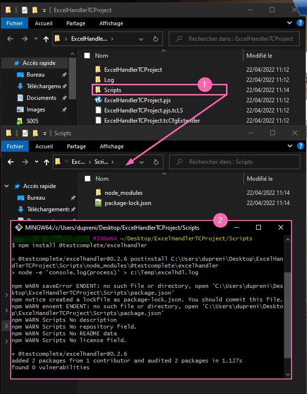
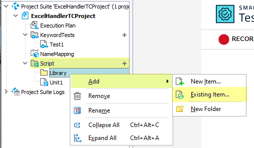
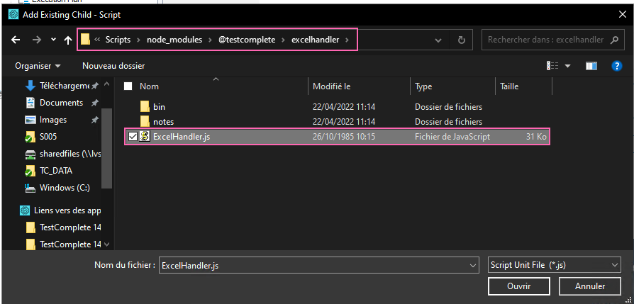
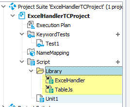
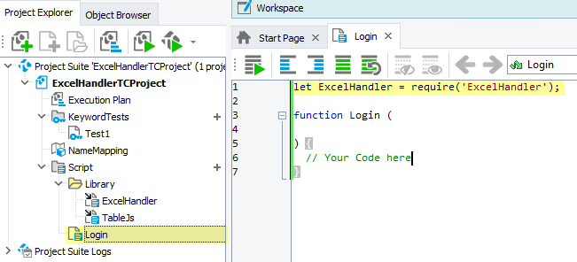

# TestComplete - ExcelHandler Interface

* **Version** : ``v0.2.0``
* **Dependancies** :
    * ``TableJs`` : [TestComplete/Core/TableJs](https://gitlab.viseo.com/testcomplete/core/tablejs)


## Summary

[](BeginSummary)
[](EndSummary)


## ExcelHandler Setup for TestComplete

As this library is published on **npmjs**,
you can easily get library with the following command
if you have **nodejs** installed on your computer.

````bash
npm install @testcomplete/excelhandler
````

**npm** installs the package with it dependencies locally in the folder
where you type the command.

I advise to create a dedicated folder for your scripts libraries (Lib & Functions)



In **TestComplete**, you will have to add the two following file
to your project to be able **require** them in your scripts :

* [Dependency] : ``./node_modules/@neooblaster/tablejs/Bin/Table.js``
* [Package] : ``./node_modules/@testcomplete/excelhandler/ExcelHandler.js``







Once Files (Library and its dependencies) are added in TestComplete,
now you are able to required library ExcelHandler in any scripts.



You do not have to require ``TableJs``, because ``ExcelHandler`` does itself.


## Get Started with ExcelHandler

To simplify scripting, 
**Excel** file must have an header line
where the name must only contains following chars :

- Letters from **a** to **z** (Lower & Uppercase (case sensitive))
- Numbers but header name must not start with a number
- Spaces are permitted but in scripting, generated methods will trim space char.

These rules exist because, headers are used to generate methods on the instance
from the interface ``ExcelHandler``.

For instance, if you have the following **Excel** File :

| Line | A | B | C | D | E |
|---|---|---|---|---|---|
| 1 | Warehouse | Material | Prod Ord | TR | Quantity |
| 2 | SA1 | K00289 | 20001467 | 85504 | 6 |
 
````js
// Loading Library
const ExcelHandler = require('ExcelHandler');

// Instantiation Step
let ExcelHdl = new ExcelHdl('<path>').open().sheet('DATA');

// Dynamic methods available from header line :
let Warehouse = ExcelHdl.Warehouse(2); // Col A -> Warehouse -> line 2 = SA1
let Material  = ExcelHdl.Material(2);  // Col B -> Material  -> line 2 = K00289

// This one, Method has been adjusted to meet JavaScript Function naming convention rule
// by trimming space
let ProdOrd   = ExcelHdl.ProdOrd(2);   // Col C -> Prod Ord  -> Line 2 = 20001467

// Updating Cell
ExcelHdl.Quantity(2, 12);   // Col E -> Quantity -> Line 2 become 12 instead of 6

// Save modifications
ExcelHdl.save();
````


## CheatSheet

### Main Information

This cheat sheet omit advanced details to be the more concise as 
possible while resuming the most common features & usage.

* ``ExcelHandler`` considers your Excel File has an header line.
* In consequence, by default, data start at line ``2``.
* ``ExcelHandler`` trims spaces in the text of the header line to
propose valid method name.
* Special Char are not allowed in the header line.
* An header line named ``Prod Order`` will generates the method
``ProdOrder()``.
* All method presented in the current cheat sheet can be chained.


### Loading Library

* Instruction to insert at the beginning of the script to get
constructor ``ExcelHandler`` :

````js
let ExcelHandler = require('ExcelHandler');
````

### Instantiation

Instruction to place in your TC Script function :

````js
let ExcelHdl = new ExcelHandler('/path/to/excel/file');
````


### Initialization

From your ``ExcelHandler`` instance, open the **Excel File** : 

````js
ExcelHdl.open();
````


### Switching between Workbook sheets

You can at anytime, switch to provided sheet of the workbook.
Can be called only after ``.open()``.

````js
ExcelHdl.sheet('YouExcelSheetName');
````


### Specifying the data starting line

If your data does not start at line ``2``,
use the following method to set the new line :

````js
ExcelHdl.rowStartAt(3); // where 3 is the line number
````


### Defining the column name

You can specify your own column name for :

* Overwriting a column with a wrong name 
* Setting up a new column

````js
ExcelHdl.cols({
    "YourColumnName": "ExcelColumnChar",    // << Def
    "ProdOrder": "A"                        // << Exemple
});
````

Column definition is applied for the current workbook sheet.
If you switch to a new sheet. You have to repeat 
the definition (if needed).

**Note** : Any modifications made on Excel regarding columns order will 
affect definitions set with method ``cols()``.
(if `ExcelColumnChar` is hardcoded). 


### Getting Cell data

You can get any data of the Excel by calling the generated
method thanks to the header line (or you overwrite definition
thanks to `cols()`). Dynamic method accepts **one** argument which
is the **Excel Line**.

````js
let sProdOrderNr = ExcelHdl.ProdOrder(2);
````


### Updating Cell data

You can set any data of the Excel by calling the generated
method thanks to the header line (or you overwrite definition
thanks to `cols()`). 
Dynamic method accepts **two** arguments in this case where
the first one stands for the **Excel Line** and the second one stands for the
**value** to enter in the cell.

````js
ExcelHdl.Quantity(2, 12);
````


### Getting the Excel data as table

You can get the entire Excel File data in a JavaScript **array**
thank to the method ``table()``.

````js
// Will return the data of the active sheet
let aExcelData = ExcelHdl.table(); // Return TableJs Array
````

Notes :

``table()`` method returns an `Array` which has all natives JavaScript methods.
But in reality, the returned object is an instance of ``TableJs`` 
where all features are
documented here : [TestComplete/Core/TableJs](https://gitlab.viseo.com/testcomplete/core/tablejs)


### Closing / Saving the Excel file

* You can save and exit the Excel file with :

````js
ExcelHdl.save();     // Only write change in Excel
// or
ExcelHdl.save(true); // Will also clear handler on Excel File & Sheet
````

* You can leave (with save) the Excel file :

````js
ExcelHdl.close();       // Exit witout save
// or
ExcelHdl.close(true);   // Save & Exit
````